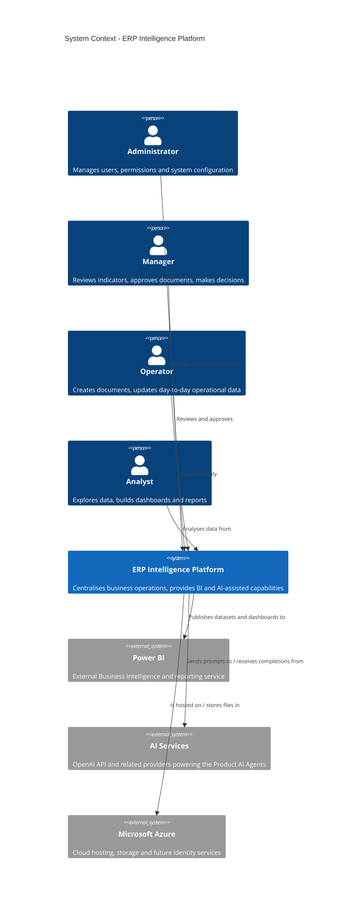
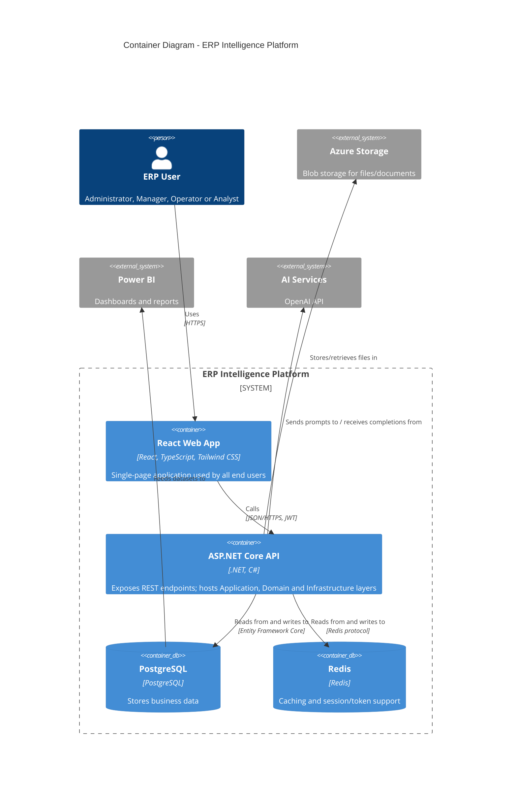
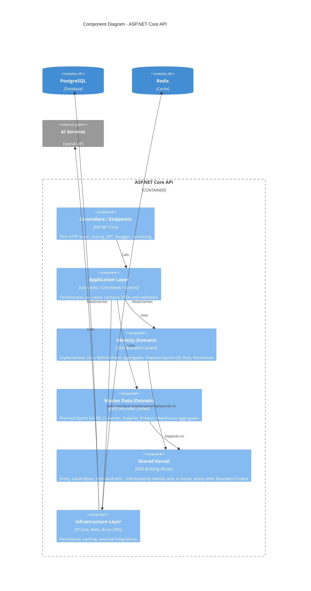

# C4 Diagrams

## ERP Intelligence Platform

**Version:** 1.0  
**Status:** Draft  
**Owner:** Helder Gonçalves

---

# 1. Purpose

This document provides the C4 model diagrams for the ERP Intelligence Platform: System Context, Container and Component levels.

It renders visually what is already described in prose in the [Software Architecture Document](../03-Software-Architecture-Document.md) (architecture overview, technology stack, Clean Architecture layers) and the [Product Requirements Document](../02-Product-Requirements-Document.md) (personas).

The Code level (C4 Level 4) is intentionally omitted: it would need to be regenerated continuously as the codebase grows, and is better explored directly in the source tree or an IDE than maintained as a diagram.

---

# 2. Level 1 — System Context

Shows the platform as a single system, its human actors (see PRD Section 5, Personas) and the external systems it depends on.

---

# 3. Level 2 — Container

Shows the deployable/runnable units of the platform, matching the architecture overview already sketched in the Software Architecture Document (Section 3).

---

# 4. Level 3 — Component

Shows the internal structure of the ASP.NET Core API container, following the Clean Architecture layering defined in the Software Architecture Document (Section 6) and the Bounded Contexts defined in the [Domain Model](../database/Domain-Model.md).

Additional Bounded Contexts (Inventory, Sales, Purchasing, Finance, Business Intelligence, AI) will be added to this diagram as they are detailed in the Domain Model, following the same layering.

---

# 5. Diagram Governance

These diagrams are illustrative of the intended architecture, not a generated artefact. They shall be updated whenever:

- a new Container is introduced (for example, a new deployable service);
- a new Bounded Context is added to the Domain Model;
- an external system dependency changes.

They are rendered directly from Mermaid syntax, viewable in GitHub, VS Code, Cursor and most Markdown-aware tools without additional plugins.

---

# 6. Relationship with Other Documents

This document should be read together with:

- Software Architecture Document
- Domain Model
- Entity Relationship Diagram
- Product Requirements Document

---

# 7. Success Criteria

These diagrams shall be considered successful when a new contributor — human or AI — can understand the system's boundaries, containers and internal component layering without reading the full Software Architecture Document.
