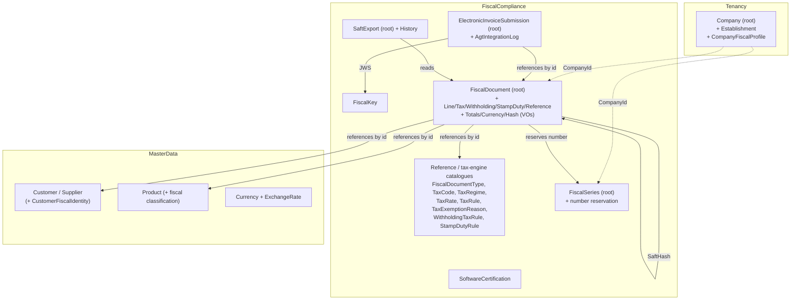

# Domain Model

## ERP Intelligence Platform

**Version:** 1.0  
**Status:** Draft  
**Owner:** Helder Gonçalves

---

# 1. Purpose

This document defines the tactical Domain-Driven Design model of the ERP Intelligence Platform.

While the [Data Model](Data-Model.md) describes business concepts at a conceptual level, this document describes how those concepts are expressed as DDD building blocks — Aggregates, Entities, Value Objects and Domain Events — within each Bounded Context defined in the [Software Architecture Document](../03-Software-Architecture-Document.md).

This document supports [ADR-0001](../decisions/ADR-0001.md), which established Clean Architecture and Domain-Driven Design as the project's architectural foundation.

---

# 2. Modelling Approach

Each Bounded Context owns one or more Aggregates.

Each Aggregate has exactly one Aggregate Root, which is the only entry point for modifying the Aggregate's internal state and is responsible for enforcing its invariants.

Entities other than the Aggregate Root are only accessible through the root.

Value Objects are immutable and compared by value rather than identity.

Domain Events represent significant business occurrences and are raised by Aggregate Roots.

`Entity<TId>`, `ValueObject` and `IDomainEvent` — the concrete base types backing this modelling approach — live in `ERP.SharedKernel` and are reused across Bounded Contexts rather than reimplemented per Aggregate. Domain projects may reference `ERP.SharedKernel` only; they may never reference `ERP.Application`, `ERP.Infrastructure` or `ERP.Api` (enforced by the `DomainReferenceTests` architecture test).

---

# 3. Identity Bounded Context

## User Aggregate — *Implemented, Sprint 02*

- Aggregate Root: `User` (inherits `Entity<Guid>`)
- Value Objects: `EmailAddress`, `PasswordHash` (inherit `ValueObject`)
- Domain Events: `UserRegistered`, `UserAuthenticated`

## RefreshToken Aggregate — *Implemented, Sprint 02*

- Aggregate Root: `RefreshToken` (inherits `Entity<Guid>`)
- Domain Events: `RefreshTokenIssued`, `RefreshTokenRevoked`

## Role Aggregate — *Implemented, Sprint 03*

- Aggregate Root: `Role` (inherits `Entity<Guid>`)
- Entities: `Permission`, `RolePermission`, `UserRole` (inherit `Entity<Guid>`)
- Domain Events: `RoleCreated`, `PermissionAssigned`, `PermissionRevoked`, `RoleAssignedToUser`

Implemented in [Sprint 03](../backlog/Sprint-03.md).

---

# 4. Master Data Bounded Context

Implemented incrementally from [Sprint 04](../backlog/Sprint-04.md) through [Sprint 08](../backlog/Sprint-08.md).

From Sprint 09a, the `Customer`, `Supplier`, `Product`, `Category`, `UnitOfMeasure`, `TaxCode`
and `Warehouse` roots implement the company-owned contract and carry a required `CompanyId`.
Their child entities inherit the scope through their aggregate root. Codes are unique per company.

## Customer Aggregate — *Implemented, Sprint 05*

- Aggregate Root: `Customer` (inherits `Entity<Guid>`)
- Value Objects: `CustomerCode` (inherits `ValueObject`; immutable after creation)
- Entities: `CustomerContact`, `CustomerAddress` (inherit `Entity<Guid>` and are modified only through the `Customer` root)
- Domain Events: `CustomerCreated`, `CustomerDeactivated`

Implemented in [Sprint 05](../backlog/Sprint-05.md). `Customer` intentionally contains no pricing, credit-limit, order, statement or CRM data.

## Supplier Aggregate — *Implemented, Sprint 06*

- Aggregate Root: `Supplier` (inherits `Entity<Guid>`)
- Value Objects: `SupplierCode` (inherits `ValueObject`; immutable after creation)
- Entities: `SupplierContact`, `SupplierAddress` (inherit `Entity<Guid>` and are modified only through the `Supplier` root)
- Domain Events: `SupplierCreated`, `SupplierDeactivated`

Implemented in [Sprint 06](../backlog/Sprint-06.md). `Supplier` intentionally contains no contracts, price lists, performance evaluation, purchase orders, goods receipts or supplier statement data.

## Product Aggregate — *Implemented, Sprint 04*

- Aggregate Root: `Product` (inherits `Entity<Guid>`)
- Value Objects: `ProductCode` (inherits `ValueObject`; immutable after creation)
- Related Reference Entities: `Category`, `UnitOfMeasure` (inherit `Entity<Guid>`)
- Domain Events: `ProductCreated`, `ProductDeactivated`

Implemented in [Sprint 04](../backlog/Sprint-04.md). `Product` intentionally contains no stock, inventory, price, barcode, image or variant data. `TaxCode` is managed independently from Sprint 08a; assigning it to Product and price modelling remain future Master Data/Pricing work.

## Warehouse Aggregate — *Implemented, Sprint 07*

- Aggregate Root: `Warehouse` (inherits `Entity<Guid>`)
- Value Objects: `WarehouseCode` (inherits `ValueObject`; immutable after creation)
- Related Reference Entities: `WarehouseType` (inherits `Entity<Guid>`; seeded and read-only)
- Domain Events: `WarehouseCreated`, `WarehouseDeactivated`

Implemented in [Sprint 07](../backlog/Sprint-07.md). `Warehouse` intentionally contains no stock,
movement, transfer, bin-location, picking or default-warehouse logic; those concerns remain planned
for the Inventory domain or later product decisions.

## Shared Reference Data

### Managed Reference Data — *Implemented, Sprint 08a*

- Entities: `Category`, `UnitOfMeasure`, `TaxCode` (inherit `Entity<Guid>`)
- Common rules: normalized immutable `Code`, required `Name`, audit timestamps and idempotent soft deactivation
- Tax-specific rule: `TaxCode.Rate` is a percentage from `0` through `100`
- Domain Events: creation and deactivation events for each managed entity

`Category` and `UnitOfMeasure` were first introduced as seeded Product Catalog references in Sprint 04 and evolved in place in Sprint 08a. `TaxCode` was added in Sprint 08a as an independent reference list; tax calculations and Product assignment are outside this increment.

### Seeded Read-Only Reference Data — *Implemented, Sprint 08b*

- Entities: `Country`, `Currency`, `PaymentTerm` (inherit `Entity<Guid>`)
- Common rules: required normalized `Code`, required `Name`, deterministic seeded identity and no user-managed lifecycle
- Standard-specific rules: Country uses ISO 3166-1 alpha-2 codes; Currency uses ISO 4217 codes; PaymentTerm requires `NetDays >= 0`
- API behavior: authenticated GET-only lists ordered by code

`WarehouseType` is implemented as seeded, read-only reference data for Warehouse Management in Sprint 07. Sprint 08b adds curated Country and Currency catalogs plus NET0/15/30/60/90 Payment Terms for reuse by future Purchasing, Sales and Finance modules. These entities have no timestamps, domain events, soft delete or write use cases.

These entities are shared across Bounded Contexts through the Shared Kernel and shall never contain transactional business logic.

Sprint 08b completes EP-003 - Master Data. Language Configuration remains deferred pending a concrete specification.

## Fiscal Extensions to Master Data — *Planned, EP-015*

The commercial pivot ([ADR-0004](../decisions/ADR-0004.md)) extends existing Master Data aggregates with fiscal fields, and moves `TaxCode` into the FiscalCompliance context. These are extensions to existing aggregates, not new ones:

- `Customer` and `Supplier`, already company-scoped in Sprint 09a, gain a `CustomerFiscalIdentity` value object (NIF, `customerKind`, `taxIdStatus`), a structured fiscal address and a fiscal country.
- `Product`, already company-scoped in Sprint 09a, gains a fiscal classification (`ProductType`, SAF-T code, fiscal/tax category, customs details).
- `Currency` (global catalogue) gains a separate small `ExchangeRate` aggregate (rates by date/source) rather than being inflated.
- `TaxCode` **moves from Master Data (Sprint 08a) into the FiscalCompliance tax engine** and is extended (see §6); the Sprint-08a shape is superseded.

Global catalogues (`Country`, `Currency`, `PaymentTerm`, exemption codes) remain **tenant-agnostic** (no `CompanyId`).

---

# 5. Tenancy Bounded Context

*Implemented, Sprint 09a.* Introduced by [ADR-0005](../decisions/ADR-0005.md); establishes the company/taxpayer identity that scopes all fiscal and transactional data.

## Company Aggregate — *Implemented, Sprint 09a*

- Aggregate Root: `Company` (the tenant; `CompanyId` scopes company-owned aggregates)
- Entities (via root): `Establishment` (1..N)
- Owned data: `CompanyFiscalProfile` (NIF, `vatRegime` {General | Simplified | CashVat | Exclusion}, fiscal address)
- Value Objects: `Nif`, `FiscalAddress`
- Domain Events: `CompanyRegistered`, `EstablishmentAdded`, `FiscalProfileUpdated`

`UserCompany` links each global Identity user to one company in this phase. Registration assigns the
default company, login emits a `companyId` JWT claim, and company-owned data is filtered by that
current company through an EF Core global query filter. Global reference catalogues are exempt.
PostgreSQL row-level security, company switching, SAF-T header data and AGT credential references
remain planned.

---

# 6. FiscalCompliance Bounded Context

*Planned, EP-015 (Sprints 09–12).* The single authority for Angolan fiscal rules, documents, numbering, signatures, SAF-T and AGT integration, per [ADR-0004](../decisions/ADR-0004.md) (see its §4.1 for the validated model and the owner-validated [discovery](../compliance/Angola-Fiscal-Compliance-Discovery.md)). This context is a data-model-first foundation that **precedes** the transactional modules. All aggregates are company-scoped except the global catalogues noted below.

## Fiscal Reference & Tax-Engine Catalogues — *Planned, EP-015*

Each is a small aggregate, versioned by `validFrom`/`validTo` and referenced by documents by id/code (with a snapshot stored on the document):

- `FiscalDocumentType` (global, law-driven: `family` {SalesInvoice | Payment | MovementOfGoods | WorkingDocument}, `saftSection`, `saftTypeCode`, `agtDocumentType`, behaviour flags)
- `TaxCode`/TaxTable (moved from Sprint 08a and extended: `taxType`, `taxCountryRegion`, `saftTaxCode` {NOR|ISE|RED|INT|NS}, `percentage`/`fixedAmount`, `regime`, `legalReference`, effective dates)
- `TaxRegime`, `TaxRate`, `TaxRule`
- `TaxExemptionReason` (the AGT M-code catalogue; seeded from official annexes)
- `WithholdingTaxRule`, `StampDutyRule`
- Domain Events: creation / deactivation / new-version events per catalogue

## SoftwareCertification Aggregate — *Planned, EP-015*

- Aggregate Root: `SoftwareCertification` (**global**, about the software product/producer)
- Data: `validationNumberPublic` (e.g. `41/AGT/2019`), `validationNumberApi` (e.g. `C_134`), certified version, producer NIF, producer public key reference
- Domain Events: `SoftwareCertificationRegistered`, `SoftwareVersionCertified`

## FiscalKey Aggregate — *Planned, EP-015*

- Aggregate Root: `FiscalKey` (owner: SoftwareProducer **or** Taxpayer; purpose: Software/Document/Request signature)
- Rules: PEM; RSA ≥ 2048; **private key encrypted at rest / HSM**, never exposed; rotation and revocation supported; a revoked key blocks new signatures but historical ones remain verifiable
- Domain Events: `FiscalKeyRegistered`, `FiscalKeyRotated`, `FiscalKeyRevoked`

## FiscalSeries Aggregate — *Planned, EP-015 (Sprint 10)*

- Aggregate Root: `FiscalSeries` (scoped by taxpayer + establishment + document type + fiscal year + contingency)
- Owned: the **next-number reservation** (concurrency-safe boundary), the AGT-authorized range, `status` {Open | InUse | Closed}, `isDefault`; optional child `FiscalDocumentNumber` ledger (Reserved | Consumed | Voided)
- Invariants: sequential, gap-free per series; respect the AGT authorized range; exactly one default per taxpayer+establishment+type+year
- Domain Events: `SeriesRequested`, `SeriesAuthorized`, `NumberReserved`, `SeriesExtensionRequested`, `SeriesClosed`

The **establishment is bound at the series level** (each `FiscalSeries` references one `Establishment`, as the AGT `solicitarSerie` requires an `establishmentNumber`). The `Establishment` itself is defined at company level (Company 1..N Establishment, §5). A `FiscalDocument`'s establishment is therefore **derived from its series** — there is no separate establishment field on `FiscalDocument`, avoiding any divergence between a document and its series.

## FiscalDocument Aggregate — *Planned, EP-015 (Sprint 10)*

A **single aggregate for all document families**, its behaviour driven by the referenced `FiscalDocumentType`.

- Aggregate Root: `FiscalDocument`
- Entities (via root): `FiscalDocumentLine`, `FiscalDocumentTax`, `FiscalDocumentWithholding`, `FiscalDocumentStampDuty`, `FiscalDocumentReference` (NC → original; receipt → settled document)
- Value Objects: `FiscalDocumentTotals` (net / tax / gross / withholding / payable), `FiscalDocumentCurrency`, `Money`, `DocumentHash` (+ `PreviousHash`, the SAF-T chain), and **snapshots** (customer fiscal data, exemption mention + legal reference, software-certification number)
- References by id: `Company`, `Establishment`, `Customer`, `Product` (per line), `FiscalDocumentType`, `FiscalSeries`, `TaxCode`, `TaxExemptionReason`
- Invariants: **immutable once finalised** (corrections only via new documents); gap-free legal number taken from `FiscalSeries`; NC requires an original reference; decimal money with the AGT rounding rules; the SAF-T hash is chained per series/type and computed at finalisation
- Domain Events (the `FiscalDocumentEvent` stream): `DraftCreated`, `DraftUpdated`, `Issued`, `Signed`, `SubmittedToAgt`, `AcceptedByAgt`, `RejectedByAgt`, `Cancelled`, `CorrectedByCreditNote`, `PrintedOriginal`, `PrintedCopy`, `ExportedToSaft`

The **SAF-T document hash** (a `FiscalDocumentSignature` of type `SaftHash`) is owned by `FiscalDocument`; the **JWS document signature** is owned by `ElectronicInvoiceSubmission` (different, asynchronous lifecycle).

## ElectronicInvoiceSubmission Aggregate — *Planned, EP-015 (Sprint 12)*

- Aggregate Root: `ElectronicInvoiceSubmission` (references `FiscalDocument` by id)
- Data: `jwsDocumentSignature` (RS256), `requestID`, state machine (`Pending → Submitted → Accepted / Rejected`)
- Entities (via root): `AgtIntegrationLog`
- Rules: **asynchronous outbox** — document finalisation must not block on the AGT; idempotent retries; resilient to AGT downtime
- Domain Events: `SubmissionQueued`, `SubmissionSent`, `SubmissionAccepted`, `SubmissionRejected`

## SaftExport Aggregate — *Planned, EP-015 (Sprint 11)*

- Aggregate Root: `SaftExport` (per company + fiscal period; stores the schema version used)
- Entities (via root): `SaftExportHistory`
- Rules: XML validated against the official XSD (v1.01_01); validate references / TaxTable / totals / hash chain before export
- Domain Events: `SaftExportGenerated`, `SaftExportValidated`

## Auditability

`AuditLog` is an append-only, cross-cutting audit facility (technical), complementary to the `FiscalDocument` event stream. Finalised fiscal records are immutable and retained for the legal period (≥ 5 years; parametrizable).

## Aggregate boundaries (overview)

---

# 7. Inventory, Sales, Purchasing and Finance Bounded Contexts

The Aggregates for these Bounded Contexts (Stock, Sales Orders, Purchase Orders, Invoices, Payments, and related entities) will be detailed here as each corresponding Epic is planned in the Product Backlog, following the same modelling approach defined in Section 2. Sales invoices, receipts and movement documents are **fiscal documents owned by the FiscalCompliance context** (§6); Sales/Finance build on that foundation rather than reimplementing fiscal rules.

---

# 8. Business Intelligence and AI Bounded Contexts

These contexts consume domain data from the other Bounded Contexts rather than owning their own transactional Aggregates. Their models will be documented here once their supporting Epics (EP-008 and EP-009) are scheduled for implementation.

---

# 9. Domain Events and Integration

Domain Events raised within one Bounded Context shall not directly invoke behaviour in another Bounded Context.

Cross-context reactions shall be handled through explicit, documented integration points, in line with the Event-Driven Architecture principle defined in the Software Architecture Document.

---

# 10. Relationship with Other Documents

This document should be read together with:

- Data Model
- Entity Relationship Diagram
- Software Architecture Document
- ADR-0001
- Migration Strategy

---

# 11. Success Criteria

The Domain Model shall be considered successful when:

- every Aggregate has a single, well-defined Aggregate Root;
- business invariants are enforced inside the Domain layer rather than in the API or database;
- the model evolves incrementally alongside the Product Backlog rather than being defined upfront in full detail;
- new Bounded Contexts are added here before implementation begins.
