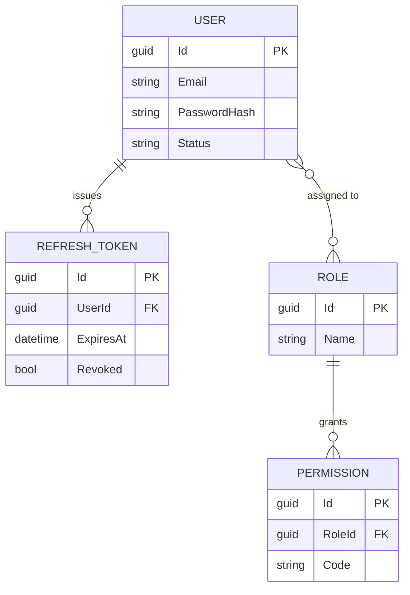
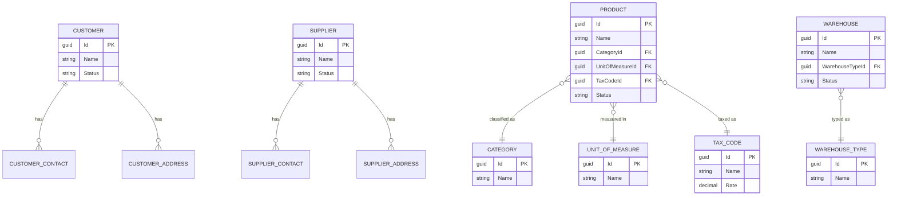

# Entity Relationship Diagram

## ERP Intelligence Platform

**Version:** 1.0  
**Status:** Draft  
**Owner:** Helder Gonçalves

---

# 1. Purpose

This document provides the conceptual Entity Relationship Diagram (ERD) for the entities currently defined in the [Data Model](Data-Model.md) and the [Domain Model](Domain-Model.md).

It covers the Identity and Master Data Bounded Contexts, which correspond to the scope already planned in Sprints 02 through 08 of the [Product Backlog](../backlog/Product-Backlog.md).

Inventory, Sales, Purchasing, Finance, Business Intelligence and AI entities will be added here as their corresponding Epics are planned in detail.

---

# 2. Diagram Notation

The diagram uses Mermaid ER notation. `||--o{` denotes a one-to-many relationship; `||--||` denotes a one-to-one relationship.

---

# 3. Identity Bounded Context

---

# 4. Master Data Bounded Context

---

# 5. Shared Reference Data

`Country`, `Currency` and `PaymentTerm` are standalone reference tables (no foreign keys into Identity or Master Data) consumed by future Sales, Purchasing and Finance entities. They are omitted from the diagrams above for clarity and will be connected once those Bounded Contexts are modelled.

---

# 6. Diagram Governance

This diagram is illustrative of the conceptual model, not a physical database schema.

Physical schema details (indexes, constraints, exact column types) are the responsibility of the Entity Framework Core migrations described in the [Migration Strategy](Migration-Strategy.md), and shall follow the [Naming Conventions](Naming-Conventions.md).

This diagram shall be updated whenever a new Aggregate is added to the Domain Model.

---

# 7. Relationship with Other Documents

This document should be read together with:

- Data Model
- Domain Model
- Naming Conventions
- Migration Strategy
- Software Architecture Document

---

# 8. Success Criteria

This diagram shall be considered successful when it remains an accurate, up-to-date reflection of the entities defined in the Data Model and Domain Model, allowing engineers and AI assistants to reason about relationships without inspecting the database directly.
