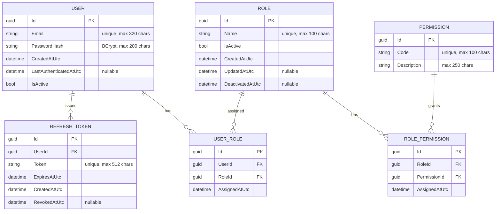
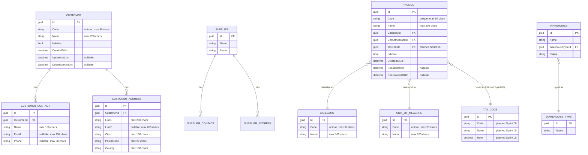

# Entity Relationship Diagram

## ERP Intelligence Platform

**Version:** 1.0  
**Status:** Draft  
**Owner:** Helder Gonçalves

---

# 1. Purpose

This document provides the conceptual Entity Relationship Diagram (ERD) for the entities currently defined in the [Data Model](Data-Model.md) and the [Domain Model](Domain-Model.md).

It covers the Identity and Master Data Bounded Contexts, which correspond to the scope planned in Sprints 02 through 08 of the [Product Backlog](../backlog/Product-Backlog.md). `User` and `RefreshToken` were implemented in Sprint 02; `Role`, `Permission`, `RolePermission` and `UserRole` were implemented in Sprint 03; `Product`, `Category` and `UnitOfMeasure` were implemented in Sprint 04; `Customer`, `CustomerContact` and `CustomerAddress` were implemented in Sprint 05. The implemented columns below match the actual `AppDbContext` mapping.

Inventory, Sales, Purchasing, Finance, Business Intelligence and AI entities will be added here as their corresponding Epics are planned in detail.

---

# 2. Diagram Notation

The diagram uses Mermaid ER notation. `||--o{` denotes a one-to-many relationship; `||--||` denotes a one-to-one relationship.

---

# 3. Identity Bounded Context

`ROLE`, `PERMISSION`, `USER_ROLE` and `ROLE_PERMISSION` were implemented in [Sprint 03](../backlog/Sprint-03.md).

---

# 4. Master Data Bounded Context

Implemented incrementally from [Sprint 04](../backlog/Sprint-04.md) through [Sprint 08](../backlog/Sprint-08.md). Product Catalog fields without a "planned" annotation reflect the Sprint 04 implementation; Customer fields reflect the Sprint 05 implementation; Supplier, Warehouse and additional shared reference data remain target/planned model.

---

# 5. Shared Reference Data

`Category` and `UnitOfMeasure` were implemented in [Sprint 04](../backlog/Sprint-04.md) as seeded reference data for Product Catalog. `TaxCode`, `Country`, `Currency` and `PaymentTerm` remain planned reference data for Sprint 08. `TaxCodeId` is intentionally not present in the Sprint 04 `Product` table or EF model; it is shown here only as the planned Product Catalog tax extension.

`Customer`, `CustomerContact` and `CustomerAddress` were implemented in [Sprint 05](../backlog/Sprint-05.md). Contacts and addresses are entities inside the `Customer` Aggregate and are managed exclusively through the `Customer` root, not through independent API resources.

---

# 6. Diagram Governance

This diagram is illustrative of the conceptual model, not a physical database schema.

Physical schema details (indexes, constraints, exact column types) are the responsibility of the Entity Framework Core migrations described in the [Migration Strategy](Migration-Strategy.md), and shall follow the [Naming Conventions](Naming-Conventions.md).

This diagram shall be updated whenever a new Aggregate is added to the Domain Model.

---

# 7. Relationship with Other Documents

This document should be read together with:

- Data Model
- Domain Model
- Naming Conventions
- Migration Strategy
- Software Architecture Document

---

# 8. Success Criteria

This diagram shall be considered successful when it remains an accurate, up-to-date reflection of the entities defined in the Data Model and Domain Model, allowing engineers and AI assistants to reason about relationships without inspecting the database directly.
