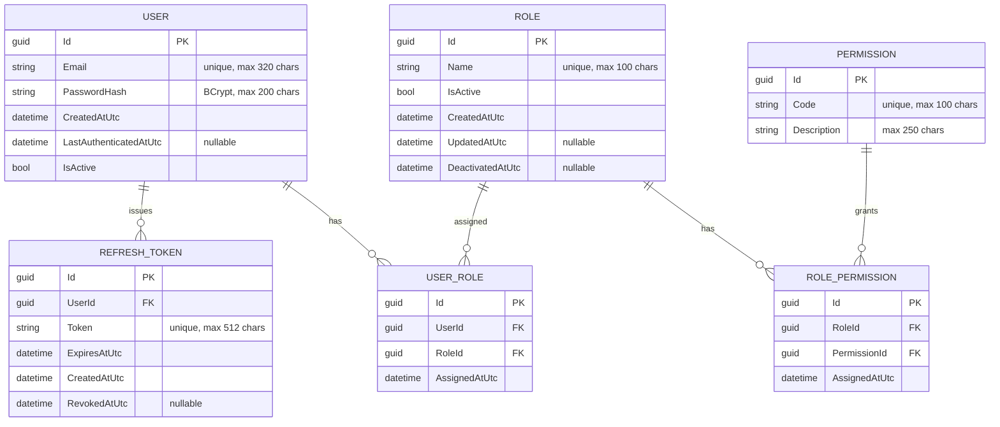
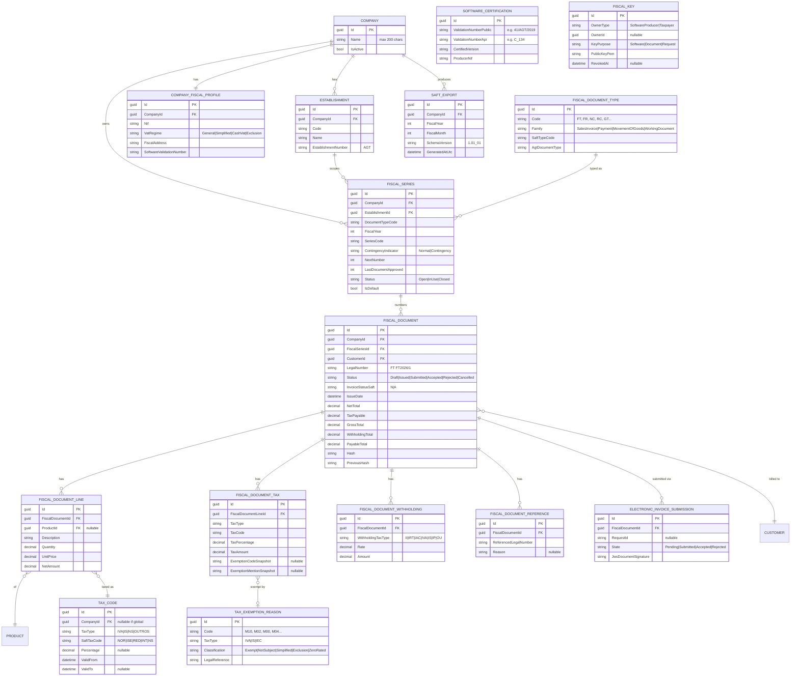

# Entity Relationship Diagram

## ERP Intelligence Platform

**Version:** 1.0  
**Status:** Draft  
**Owner:** Helder Gonçalves

---

# 1. Purpose

This document provides the conceptual Entity Relationship Diagram (ERD) for the entities currently defined in the [Data Model](Data-Model.md) and the [Domain Model](Domain-Model.md).

It covers the Identity and Master Data Bounded Contexts, which correspond to the scope planned in Sprints 02 through 08 of the [Product Backlog](../backlog/Product-Backlog.md). `User` and `RefreshToken` were implemented in Sprint 02; `Role`, `Permission`, `RolePermission` and `UserRole` were implemented in Sprint 03; `Product`, `Category` and `UnitOfMeasure` were implemented in Sprint 04; `Customer`, `CustomerContact` and `CustomerAddress` were implemented in Sprint 05; `Supplier`, `SupplierContact` and `SupplierAddress` were implemented in Sprint 06; `Warehouse` and `WarehouseType` were implemented in Sprint 07; managed `Category`, `UnitOfMeasure` plus `TaxCode` were implemented in Sprint 08a; and seeded `Country`, `Currency` plus `PaymentTerm` were implemented in Sprint 08b. The implemented columns below match the actual `AppDbContext` mapping.

Inventory, Sales, Purchasing, Finance, Business Intelligence and AI entities will be added here as their corresponding Epics are planned in detail.

---

# 2. Diagram Notation

The diagram uses Mermaid ER notation. `||--o{` denotes a one-to-many relationship; `||--||` denotes a one-to-one relationship.

---

# 3. Identity Bounded Context

```mermaid
erDiagram
    USER ||--o{ REFRESH_TOKEN : issues
    USER ||--o{ USER_ROLE : has
    ROLE ||--o{ USER_ROLE : assigned
    ROLE ||--o{ ROLE_PERMISSION : has
    PERMISSION ||--o{ ROLE_PERMISSION : grants

    USER {
        guid Id PK
        string Email "unique, max 320 chars"
        string PasswordHash "BCrypt, max 200 chars"
        datetime CreatedAtUtc
        datetime LastAuthenticatedAtUtc "nullable"
        bool IsActive
    }
    REFRESH_TOKEN {
        guid Id PK
        guid UserId FK
        string Token "unique, max 512 chars"
        datetime ExpiresAtUtc
        datetime CreatedAtUtc
        datetime RevokedAtUtc "nullable"
    }
    ROLE {
        guid Id PK
        string Name "unique, max 100 chars"
        bool IsActive
        datetime CreatedAtUtc
        datetime UpdatedAtUtc "nullable"
        datetime DeactivatedAtUtc "nullable"
    }
    PERMISSION {
        guid Id PK
        string Code "unique, max 100 chars"
        string Description "max 250 chars"
    }
    USER_ROLE {
        guid Id PK
        guid UserId FK
        guid RoleId FK
        datetime AssignedAtUtc
    }
    ROLE_PERMISSION {
        guid Id PK
        guid RoleId FK
        guid PermissionId FK
        datetime AssignedAtUtc
    }
```

`ROLE`, `PERMISSION`, `USER_ROLE` and `ROLE_PERMISSION` were implemented in [Sprint 03](../backlog/Sprint-03.md).

---

# 4. Master Data Bounded Context

Implemented incrementally from [Sprint 04](../backlog/Sprint-04.md) through [Sprint 08](../backlog/Sprint-08.md). Product Catalog fields without a "planned" annotation reflect the Sprint 04 implementation; Customer fields reflect the Sprint 05 implementation; Supplier fields reflect the Sprint 06 implementation; Warehouse fields reflect the Sprint 07 implementation; managed Category, UnitOfMeasure and TaxCode fields reflect Sprint 08a; seeded Country, Currency and PaymentTerm fields reflect Sprint 08b.

```mermaid
erDiagram
    CUSTOMER ||--o{ CUSTOMER_CONTACT : has
    CUSTOMER ||--o{ CUSTOMER_ADDRESS : has

    SUPPLIER ||--o{ SUPPLIER_CONTACT : has
    SUPPLIER ||--o{ SUPPLIER_ADDRESS : has

    PRODUCT }o--|| CATEGORY : "classified as"
    PRODUCT }o--|| UNIT_OF_MEASURE : "measured in"
    PRODUCT }o--|| TAX_CODE : "taxed as (planned future assignment)"
    WAREHOUSE }o--|| WAREHOUSE_TYPE : "typed as"

    CUSTOMER {
        guid Id PK
        string Code "unique, max 50 chars"
        string Name "max 200 chars"
        bool IsActive
        datetime CreatedAtUtc
        datetime UpdatedAtUtc "nullable"
        datetime DeactivatedAtUtc "nullable"
    }
    CUSTOMER_CONTACT {
        guid Id PK
        guid CustomerId FK
        string Name "max 100 chars"
        string Email "nullable, max 254 chars"
        string Phone "nullable, max 50 chars"
    }
    CUSTOMER_ADDRESS {
        guid Id PK
        guid CustomerId FK
        string Line1 "max 200 chars"
        string Line2 "nullable, max 200 chars"
        string City "max 100 chars"
        string PostalCode "max 20 chars"
        string Country "max 100 chars"
    }
    SUPPLIER {
        guid Id PK
        string Code "unique, max 50 chars"
        string Name "max 200 chars"
        bool IsActive
        datetime CreatedAtUtc
        datetime UpdatedAtUtc "nullable"
        datetime DeactivatedAtUtc "nullable"
    }
    SUPPLIER_CONTACT {
        guid Id PK
        guid SupplierId FK
        string Name "max 100 chars"
        string Email "nullable, max 254 chars"
        string Phone "nullable, max 50 chars"
    }
    SUPPLIER_ADDRESS {
        guid Id PK
        guid SupplierId FK
        string Line1 "max 200 chars"
        string Line2 "nullable, max 200 chars"
        string City "max 100 chars"
        string PostalCode "max 20 chars"
        string Country "max 100 chars"
    }
    PRODUCT {
        guid Id PK
        string Code "unique, max 50 chars"
        string Name "max 200 chars"
        guid CategoryId FK
        guid UnitOfMeasureId FK
        guid TaxCodeId FK "planned future assignment"
        bool IsActive
        datetime CreatedAtUtc
        datetime UpdatedAtUtc "nullable"
        datetime DeactivatedAtUtc "nullable"
    }
    CATEGORY {
        guid Id PK
        string Code "unique, max 50 chars"
        string Name "max 100 chars"
        bool IsActive
        datetime CreatedAtUtc
        datetime UpdatedAtUtc "nullable"
        datetime DeactivatedAtUtc "nullable"
    }
    UNIT_OF_MEASURE {
        guid Id PK
        string Code "unique, max 50 chars"
        string Name "max 100 chars"
        bool IsActive
        datetime CreatedAtUtc
        datetime UpdatedAtUtc "nullable"
        datetime DeactivatedAtUtc "nullable"
    }
    TAX_CODE {
        guid Id PK
        string Code "unique, max 50 chars"
        string Name "max 100 chars"
        decimal Rate "numeric(5,2), 0 to 100"
        bool IsActive
        datetime CreatedAtUtc
        datetime UpdatedAtUtc "nullable"
        datetime DeactivatedAtUtc "nullable"
    }
    WAREHOUSE {
        guid Id PK
        string Code "unique, max 50 chars"
        string Name "max 200 chars"
        guid WarehouseTypeId FK
        bool IsActive
        datetime CreatedAtUtc
        datetime UpdatedAtUtc "nullable"
        datetime DeactivatedAtUtc "nullable"
    }
    WAREHOUSE_TYPE {
        guid Id PK
        string Code "unique, max 50 chars, seeded"
        string Name "max 100 chars, seeded"
    }
    COUNTRY {
        guid Id PK
        string Code "unique, 2 chars, seeded"
        string Name "max 100 chars, seeded"
    }
    CURRENCY {
        guid Id PK
        string Code "unique, 3 chars, seeded"
        string Name "max 100 chars, seeded"
    }
    PAYMENT_TERM {
        guid Id PK
        string Code "unique, max 50 chars, seeded"
        string Name "max 100 chars, seeded"
        int NetDays "non-negative, seeded"
    }
```

---

# 5. Tenancy & FiscalCompliance Bounded Contexts — *planned, EP-015*

Conceptual ERD for the commercial-pivot foundation ([ADR-0004](../decisions/ADR-0004.md),
[ADR-0005](../decisions/ADR-0005.md); [Domain Model](Domain-Model.md) §5–6). Attributes are
representative, not exhaustive; all company-owned tables also carry `CompanyId` (tenancy), while
global catalogues do not. Existing Master Data entities are **extended** under EP-015 (not redrawn
here): `Customer`/`Supplier` gain a fiscal identity (NIF, `customerKind`, fiscal address) and
`CompanyId`; `Product` gains a fiscal classification (`ProductType`, SAF-T code, tax category,
customs) and `CompanyId`; `Currency` gains an `ExchangeRate` table.

```mermaid
erDiagram
    COMPANY ||--o{ ESTABLISHMENT : has
    COMPANY ||--|| COMPANY_FISCAL_PROFILE : has
    COMPANY ||--o{ FISCAL_SERIES : owns
    ESTABLISHMENT ||--o{ FISCAL_SERIES : scopes
    FISCAL_DOCUMENT_TYPE ||--o{ FISCAL_SERIES : "typed as"
    FISCAL_SERIES ||--o{ FISCAL_DOCUMENT : numbers
    FISCAL_DOCUMENT ||--o{ FISCAL_DOCUMENT_LINE : has
    FISCAL_DOCUMENT ||--o{ FISCAL_DOCUMENT_TAX : has
    FISCAL_DOCUMENT ||--o{ FISCAL_DOCUMENT_WITHHOLDING : has
    FISCAL_DOCUMENT ||--o{ FISCAL_DOCUMENT_REFERENCE : has
    FISCAL_DOCUMENT ||--o{ ELECTRONIC_INVOICE_SUBMISSION : "submitted via"
    FISCAL_DOCUMENT }o--|| CUSTOMER : "billed to"
    FISCAL_DOCUMENT_LINE }o--|| PRODUCT : "of"
    FISCAL_DOCUMENT_LINE }o--|| TAX_CODE : "taxed as"
    FISCAL_DOCUMENT_TAX }o--o| TAX_EXEMPTION_REASON : "exempt by"
    COMPANY ||--o{ SAFT_EXPORT : produces

    COMPANY {
        guid Id PK
        string Name "max 200 chars"
        bool IsActive
    }
    ESTABLISHMENT {
        guid Id PK
        guid CompanyId FK
        string Code
        string Name
        string EstablishmentNumber "AGT"
    }
    COMPANY_FISCAL_PROFILE {
        guid Id PK
        guid CompanyId FK
        string Nif
        string VatRegime "General|Simplified|CashVat|Exclusion"
        string FiscalAddress
        string SoftwareValidationNumber
    }
    SOFTWARE_CERTIFICATION {
        guid Id PK
        string ValidationNumberPublic "e.g. 41/AGT/2019"
        string ValidationNumberApi "e.g. C_134"
        string CertifiedVersion
        string ProducerNif
    }
    FISCAL_KEY {
        guid Id PK
        string OwnerType "SoftwareProducer|Taxpayer"
        guid OwnerId "nullable"
        string KeyPurpose "Software|Document|Request"
        string PublicKeyPem
        datetime RevokedAt "nullable"
    }
    FISCAL_DOCUMENT_TYPE {
        guid Id PK
        string Code "FT, FR, NC, RC, GT..."
        string Family "SalesInvoice|Payment|MovementOfGoods|WorkingDocument"
        string SaftTypeCode
        string AgtDocumentType
    }
    TAX_CODE {
        guid Id PK
        guid CompanyId FK "nullable if global"
        string TaxType "IVA|IS|NS|OUTROS"
        string SaftTaxCode "NOR|ISE|RED|INT|NS"
        decimal Percentage "nullable"
        datetime ValidFrom
        datetime ValidTo "nullable"
    }
    TAX_EXEMPTION_REASON {
        guid Id PK
        string Code "M10, M02, M00, M04..."
        string TaxType "IVA|IS|IEC"
        string Classification "Exempt|NotSubject|Simplified|Exclusion|ZeroRated"
        string LegalReference
    }
    FISCAL_SERIES {
        guid Id PK
        guid CompanyId FK
        guid EstablishmentId FK
        string DocumentTypeCode
        int FiscalYear
        string SeriesCode
        string ContingencyIndicator "Normal|Contingency"
        int NextNumber
        int LastDocumentApproved
        string Status "Open|InUse|Closed"
        bool IsDefault
    }
    FISCAL_DOCUMENT {
        guid Id PK
        guid CompanyId FK
        guid FiscalSeriesId FK
        guid CustomerId FK
        string LegalNumber "FT FT2026/1"
        string Status "Draft|Issued|Submitted|Accepted|Rejected|Cancelled"
        string InvoiceStatusSaft "N|A"
        datetime IssueDate
        decimal NetTotal
        decimal TaxPayable
        decimal GrossTotal
        decimal WithholdingTotal
        decimal PayableTotal
        string Hash
        string PreviousHash
    }
    FISCAL_DOCUMENT_LINE {
        guid Id PK
        guid FiscalDocumentId FK
        guid ProductId FK "nullable"
        string Description
        decimal Quantity
        decimal UnitPrice
        decimal NetAmount
    }
    FISCAL_DOCUMENT_TAX {
        guid Id PK
        guid FiscalDocumentLineId FK
        string TaxType
        string TaxCode
        decimal TaxPercentage
        decimal TaxAmount
        string ExemptionCodeSnapshot "nullable"
        string ExemptionMentionSnapshot "nullable"
    }
    FISCAL_DOCUMENT_WITHHOLDING {
        guid Id PK
        guid FiscalDocumentId FK
        string WithholdingTaxType "II|IRT|IAC|IVA|IS|IP|OU"
        decimal Rate
        decimal Amount
    }
    FISCAL_DOCUMENT_REFERENCE {
        guid Id PK
        guid FiscalDocumentId FK
        string ReferencedLegalNumber
        string Reason "nullable"
    }
    ELECTRONIC_INVOICE_SUBMISSION {
        guid Id PK
        guid FiscalDocumentId FK
        string RequestId "nullable"
        string State "Pending|Submitted|Accepted|Rejected"
        string JwsDocumentSignature
    }
    SAFT_EXPORT {
        guid Id PK
        guid CompanyId FK
        int FiscalYear
        int FiscalMonth
        string SchemaVersion "1.01_01"
        datetime GeneratedAtUtc
    }
```

---

# 6. Shared Reference Data

`Category` and `UnitOfMeasure` were implemented in [Sprint 04](../backlog/Sprint-04.md) as seeded reference data for Product Catalog, then evolved additively into managed, auditable, soft-deletable data in Sprint 08a. Existing Product foreign keys remain intact, while Product selection endpoints return active records only. `TaxCode` was implemented in Sprint 08a as independent managed reference data. `TaxCodeId` is intentionally not present in the Product table or EF model; the dashed conceptual relationship above remains a future Product Catalog tax assignment, outside Sprint 08a. Tax calculations and fiscal rules are also out of scope.

`WarehouseType` was implemented in [Sprint 07](../backlog/Sprint-07.md) as seeded, read-only reference data (`MAIN`, `TRANSIT`, `VIRTUAL`). `Country`, `Currency` and `PaymentTerm` were implemented in Sprint 08b as curated, deterministic, read-only catalogs exposed to authenticated consumers. They have no relationships yet because the Purchasing, Sales and Finance aggregates that will consume them are future work.

`Customer`, `CustomerContact` and `CustomerAddress` were implemented in [Sprint 05](../backlog/Sprint-05.md). Contacts and addresses are entities inside the `Customer` Aggregate and are managed exclusively through the `Customer` root, not through independent API resources.

`Supplier`, `SupplierContact` and `SupplierAddress` were implemented in [Sprint 06](../backlog/Sprint-06.md). Contacts and addresses are entities inside the `Supplier` Aggregate and are managed exclusively through the `Supplier` root, not through independent API resources.

---

# 7. Diagram Governance

This diagram is illustrative of the conceptual model, not a physical database schema.

Physical schema details (indexes, constraints, exact column types) are the responsibility of the Entity Framework Core migrations described in the [Migration Strategy](Migration-Strategy.md), and shall follow the [Naming Conventions](Naming-Conventions.md).

This diagram shall be updated whenever a new Aggregate is added to the Domain Model.

---

# 8. Relationship with Other Documents

This document should be read together with:

- Data Model
- Domain Model
- Naming Conventions
- Migration Strategy
- Software Architecture Document

---

# 9. Success Criteria

This diagram shall be considered successful when it remains an accurate, up-to-date reflection of the entities defined in the Data Model and Domain Model, allowing engineers and AI assistants to reason about relationships without inspecting the database directly.
